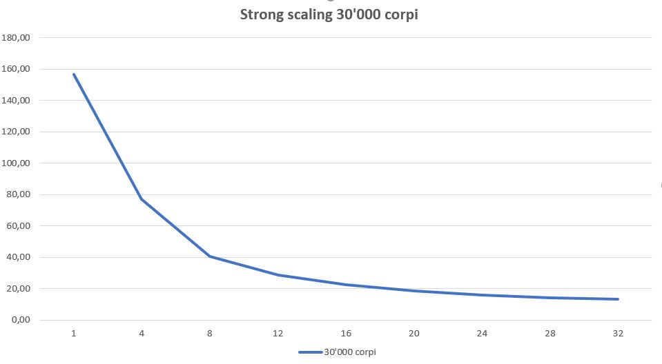

# N-body Simulation only P2P

***
## Programmazione Concorrente, Parallela e su Cloud

### Università  degli Studi di Salerno

#### *Anno Accademico 2017/2018*

**Professore:** _Vittorio Scarano_
**Dottore:** _Carmine Spagnuolo_
**Studente:** _Raffaele D'Arco_ 

## Problem Statement  

Il problema n-body consiste trovare la posizione e la velocità  di un insieme di particelle che interagiscono fra di loro in un periodo di tempo. 
Per esempio, un astrofisico potrebbe voler conoscere la posizione e la velocità  di una collezione di stelle, 
mentre un chimico potrebbe voler conoscere la posizione e la velocità  di una collezione di molecole o degli atomi. 
Un n-body solver è un programma che trova la soluzione di un problema n-body simulando il comportamento delle particelle. 
L'input del problema è la massa, la posizione, e la velocità  per ogni particella all'inizio della simulazione mentre l'output
è, tipicamente, la posizione e la velocità  di ogni particella in una sequenza di tempo specificata dall'utente, 
o semplicemente la posizione e la velocità  alla fine del periodo specificato dall'utente.

## Soluzione proposta

Consideriamo solo la soluzione che è quadratica nel numero di particelle.
Risolviamo il problema usando solo comunicazione point to point.
I test sono stati effettuati sulle istanze di AWS **m4.xlarge**. 

### Implementazione

Il compito svolto è stato quello di parallelizzare l'algoritmo sequenziale in esempio, dividendo equamente il lavoro tra i processi coinvolti.
La divisione del lavoro equo è riportata di seguito

```c
bodyProc = nBodies/world_size;		// numero medio di corpi da assegnare agli slave (numero ideale è solo se è divisibile per il numero di processi)
remaind = nBodies % world_size;	    // numero di particelle rimanenti da distribuire
if (remaind == 0) {					// se non c'è nessuna particella rimamente allora il numero medio di corpi è ideale ed è distribuito equamente
		myBodies = bodyProc;
		first = world_rank * bodyProc; // inizio blocco particelle da prendere
		last = ((world_rank + 1) * bodyProc)-1; //fine blocco particelle da prendere
		} else if (remaind > 0) { // se rimangono ancora particelle da assegnare
		if(world_rank < remaind) {
			myBodies = bodyProc + 1; // questo processo prende una particella in più
			first = world_rank * bodyProc;
			last = ((world_rank + 1 ) * bodyProc);
			}else if(world_rank >= remaind) {
			myBodies = bodyProc;
			first = world_rank * bodyProc + remaind;
			last = ((world_rank + 1) * bodyProc) + remaind - 1;
		}
	}
```

Se avessimo assegnato solo all'ultimo processo le restanti particelle, l'ultimo processo effettuava più calcoli e quindi non c'era un bilanciamento equo del carico di lavoro

I valori assegnati alle particelle vengono generati in modo casuale. Ogni processo genera la sua porzione di valori. 

```c
void randomizeBodies(){
    int i;	
	
    for(i = first; i <= last; i++){
		bodies[i].x = 2.0f * (rand() / (float) RAND_MAX) - 1.0f;
		bodies[i].y = 2.0f * (rand() / (float) RAND_MAX) - 1.0f;
		bodies[i].z = 2.0f * (rand() / (float) RAND_MAX) - 1.0f;
		bodies[i].vx = 2.0f * (rand() / (float) RAND_MAX) - 1.0f;
		bodies[i].vy = 2.0f * (rand() / (float) RAND_MAX) - 1.0f;
		bodies[i].vz = 2.0f * (rand() / (float) RAND_MAX) - 1.0f;
	}
    updateAllSlave(); // funzione che sincronizza le particelle di tutti i processori
}
```

Quando tutti i processori hanno inizializzato e aggiornato le particelle, si procede calcolando le velocità e le posizioni.
Ad ogni iterazione bisogna aggiornare le particelle in tutti i processi, perchè bisogna tener conto delle posizioni di tutte le particelle per poter effettuare i calcoli necessari.
Le velocità e le posizioni sono state calcolate in questo modo:

```c
void bodyForce(){
	
	int i;
	for (i = first; i <= last; i++){
		float Fx = 0.0f;
		float Fy = 0.0f;
		float Fz = 0.0f;
		int j;
		for (j = 0; j < nBodies; j++){
			float dx = bodies[j].x - bodies[i].x;
			float dy = bodies[j].y - bodies[i].y;
			float dz = bodies[j].z - bodies[i].z;
			float distSqr = dx * dx + dy * dy + dz * dz + SOFTENING;
			float invDist = 1.0f/sqrtf(distSqr);
			float invDist3 = invDist * invDist * invDist;
			
			Fx += dx * invDist3;
			Fy += dy * invDist3;
			Fz += dz * invDist3;
		}
		
		bodies[i].vx += dt * Fx;
		bodies[i].vy += dt * Fy;
		bodies[i].vz += dt * Fz;
	}
}

void updatePositions(){
	int i;
	for (i = first; i <= last; i++){
		bodies[i].x += bodies[i].vx * dt;
		bodies[i].y += bodies[i].vy * dt;
		bodies[i].y += bodies[i].vz * dt;
	}
}
```
I processi comunicano attraverso le funzioni MPI_Send e MPI_Recv, le quali sono state utilizzate per simulare le funzioni collettive MPI_Gather e MPI_Allgather.
Questo perchè, se avessimo usato le chiamate collective c'erano problemi relativi alla taglia dei parametri da inviare e ricevere (ogni processo non ha lo stesso numero di particelle).
Il requisito era quello di usare solo comunicazione point-to-point, ma per permettere ai processori di avere i dati sincronizzati, si è dovuta utilizzare l'istruzione MPI_Barrier.

```c
void updateAllSlave(){
	
	int i;
	
	for(i = 0; i < world_size; i++){
        gatherPointToPoint(i);
	}
	
	MPI_Barrier(MPI_COMM_WORLD);
}

void gatherPointToPoint(int root){
	if (world_rank != root){
		MPI_Send(bodies + first, myBodies, mpi_body_type, root, 0, MPI_COMM_WORLD);
	}
	else{
		int i;
		for(i = 0; i < world_size; i++){
			if(world_rank != i){
				int start;
				int receive;
				if(i < remaind) {
					receive = bodyProc + 1;
					start= receive * i; 
					} else {
					rec= bodyProc;
					start= rec * i + remaind;
				}
				MPI_Recv(bodies + start, receive, mpi_body_type, i, 0, MPI_COMM_WORLD, MPI_STATUS_IGNORE);
			}
		}
	}
}
```
Per poter avviare il programma, l'utente deve inserire i seguenti parametri:

```c
int nBodies; // numero di corpi totali
int nIters; //Numero di iterazioni
int printFreq; //frequenza di stampa
```

##INSRALLAZIONE DEL PROGRAMMA

Navigare in 
cd src/

Per eseguire il programma lanciare:

```
mpirun -np <NUMERO_PROCESSORI> nbody <NUMERO_CORPI> <NUMERO_ITERAZIONI> <FREQUENZA_DI_STAMPA>
```

### Fase di test

I test sono stati realizzati sulle istanze __m4.xlarge__ (4 core) di Amazon Web Services.  
Sono stati effettuati 3 test su ciascun input, perchè il tempo di calcolo varia ad ogni esecuzione, e si è fatta una media.

Risorse utilizzate:

* i) 8 Istanze EC2 m4.xlarge **StarCluster-Ubuntu-12.04-x86_64-hvm** - _ami-52a0c53b_
* ii) 32 processori (4 core per Istanza).

I parametri scelti per i test sono stati:
- numero di iterazioni = 10;
- frequenza di output = 10;

Nella fase di test si sono analizzate la strong scaling e la weak scaling.

Tutti i test sono stati quindi effettuati utilizzando il seguente comando 
```
mpirun -np <NUMERO_PROCESSORI> --hostfile hostlist nbody <NUMERO_CORPI> 10
```

## Strong Scaling

Per misurare la strong scaling si sono utilizzate 30.000 particelle.
In questa fase di test il numero di particelle resta inviariato, mentre il numero di processori cambia.
L'obiettivo è quello di ridurre il tempo di calcolo all'aumentare dei processori.
Nella figura seguente sono mostrati i risultati.




## Weak Scaling

Per misurare la weak scaling sono state usate prima 1000 particelle per processo e successivamente 3500 particelle per processo.
In questa fase di test il numero di particelle aumenta proporzionalmente al numero di processori.
Nella figura seguente sono mostrati i risultati.


##### Project Template

- test: cartella contenente tutti i risultati dei test dello strong e weak scaling oltre alle immagini dei grafici e dei test fatti
- nBody.c: File del problema scritto in C
- nbody: eseguibile del programma

